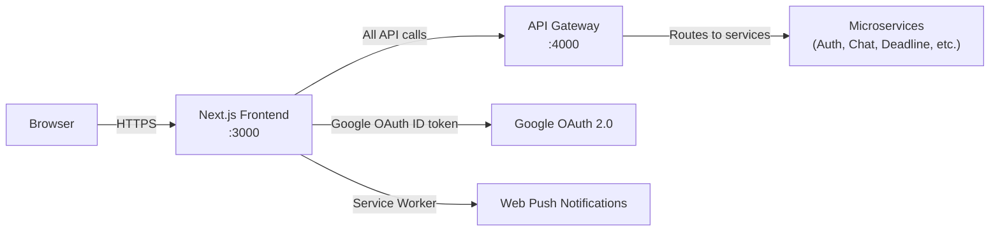
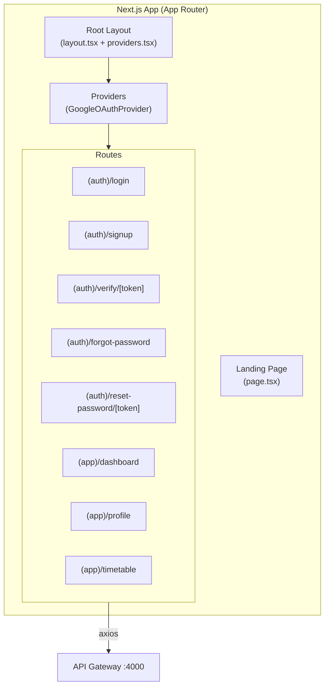
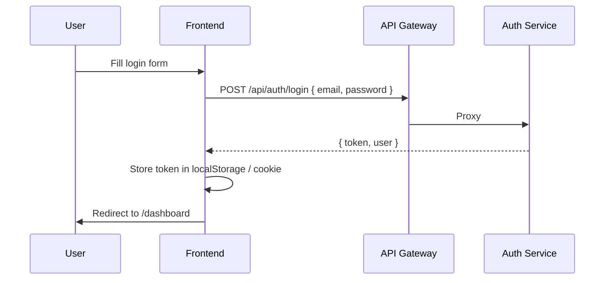

# Frontend Service — Synapto


---

## Overview

The **Frontend Service** is the Next.js 16 (App Router) client application for the Synapto platform. It serves as the user-facing interface for all platform features: authentication, dashboard, attendance tracking, timetable viewing, chat, deadline management, study material management, and AI assistant interactions. All API communication goes through the **API Gateway** at port 4000 — the frontend never calls individual microservices directly.

---

## Role in the Overall Architecture



---

## Key Features

- **App Router architecture** (Next.js 16) — file-based routing with layouts, loading states, and error boundaries
- **Authentication flows** — signup, login, Google OAuth, email verification, forgot password, reset password
- **Dashboard** — aggregated view of deadlines, attendance summary, section announcements, and recent activity
- **Timetable viewer** — displays the section's parsed timetable schedule
- **Profile management** — view and edit user profile (college, branch, year, section, phone)
- **Responsive design** — Tailwind CSS 4.x utility-first styling; mobile-first layout
- **Google OAuth client-side integration** via `@react-oauth/google`
- **Axios-based API client** — centralised request/response interceptors for JWT attachment and error handling

---

## Tech Stack

| Layer | Technology | Rationale |
|---|---|---|
| Framework | Next.js 16 (App Router) | SSR + file-based routing; optimal for hybrid pages |
| Language | TypeScript 5 | End-to-end type safety |
| UI Library | React 19 | Concurrent features; server components support |
| Styling | Tailwind CSS 4.x | Utility-first; rapid UI development |
| HTTP Client | Axios | Interceptors for JWT injection and error normalisation |
| OAuth | `@react-oauth/google` | Official React wrapper for Google Identity Services |

---

## Architecture Diagram



---

## Application Routes

| Route | Description |
|---|---|
| `/` | Landing page — redirects authenticated users to `/dashboard` |
| `/login` | Email/password login form + Google OAuth button |
| `/signup` | Registration form (name, email, password, college, branch, year, section) |
| `/verify/:token` | Email verification confirmation page |
| `/forgot-password` | Password reset request form |
| `/reset-password/:token` | New password form with token validation |
| `/dashboard` | Main authenticated view — overview of all platform features |
| `/profile` | User profile view and edit |
| `/timetable` | Section timetable viewer |

---

## Folder Structure

```
frontend_service/
├── app/
│   ├── layout.tsx              # Root layout — HTML shell, global CSS
│   ├── page.tsx                # Landing page (redirect logic)
│   ├── providers.tsx           # GoogleOAuthProvider wrapper
│   ├── globals.css             # Global Tailwind base styles
│   ├── dashboard/
│   │   └── page.tsx            # Dashboard page
│   ├── login/
│   │   └── page.tsx            # Login page
│   ├── signup/
│   │   └── page.tsx            # Signup page
│   ├── verify/
│   │   └── page.tsx            # Email verification
│   ├── forgot-password/
│   │   └── page.tsx            # Forgot password
│   ├── reset-password/
│   │   └── page.tsx            # Reset password
│   ├── profile/
│   │   └── page.tsx            # User profile
│   └── timetable/
│       └── page.tsx            # Timetable viewer
├── lib/
│   └── (shared utilities, API helpers)
├── public/
│   └── (static assets)
├── next.config.ts              # Next.js config
├── tailwind.config.mjs         # Tailwind CSS config
├── postcss.config.mjs          # PostCSS config
├── Dockerfile                  # node:20 image for containerised deployment
├── docker-compose.yml          # Frontend + dependency services
├── tsconfig.json
└── package.json
```

---

## Environment Variables

| Variable | Required | Description |
|---|:---:|---|
| `NEXT_PUBLIC_API_URL` | ✓ | API Gateway base URL (e.g., `http://localhost:4000`) |
| `NEXT_PUBLIC_GOOGLE_CLIENT_ID` | ✓ | Google OAuth 2.0 Client ID for `@react-oauth/google` |

> Variables prefixed with `NEXT_PUBLIC_` are exposed to the browser. Never prefix sensitive values.

---

## Installation

### Local Development

```bash
npm install

# Create environment file
cp .env.example .env.local
# Set NEXT_PUBLIC_API_URL and NEXT_PUBLIC_GOOGLE_CLIENT_ID

npm run dev    # starts on http://localhost:3000 (bound to 0.0.0.0)
```

### Production Build

```bash
npm run build
npm start
```

---

## Docker Setup

```bash
docker-compose up --build
# Frontend available at http://localhost:3000
```

```yaml
# docker-compose.yml (summary)
services:
  frontend:
    build: .
    ports:
      - "3000:3000"
    environment:
      NEXT_PUBLIC_API_URL: http://gateway:4000
      NEXT_PUBLIC_GOOGLE_CLIENT_ID: ${GOOGLE_CLIENT_ID}
```

---

## Authentication Flow



For Google OAuth:
1. `@react-oauth/google` renders the Google button and returns an ID token on success
2. Frontend sends `POST /api/auth/google { idToken }` to the Gateway
3. Auth Service verifies the ID token server-side; returns a platform JWT

---

## Security

- JWT is stored client-side and attached to every API request via an Axios request interceptor
- Environment variables containing secrets are **never** prefixed with `NEXT_PUBLIC_`
- The Google OAuth client ID is public (it is intentionally embedded in the browser); the client secret is kept server-side in the Auth Service

---

## Performance Optimizations

- **App Router** enables React Server Components (RSC) for data-heavy pages, reducing client-side JavaScript
- **`next dev -H 0.0.0.0`** binds to all interfaces, enabling Docker-hosted access
- **Tailwind CSS 4** tree-shakes unused utility classes in production builds
- **Next.js Image** component should be used for all images to enable automatic optimisation

---

## Design Decisions

- **Next.js App Router over Pages Router**: App Router enables layouts, server components, and streaming — better suited for an authenticated app with shared navigation shells
- **Tailwind CSS over component libraries**: Maximum design flexibility without bundle overhead of a full component library (MUI, Ant Design)
- **Axios over `fetch`**: Interceptor pattern for JWT injection and centralised error handling reduces boilerplate across every API call
- **`@react-oauth/google` over Google's raw script**: Official React wrapper; integrates cleanly with React's lifecycle

---

## Future Improvements

- [ ] Add real-time chat UI consuming Chat Service WebSocket
- [ ] Implement AI assistant chat interface with SSE streaming display
- [ ] Add attendance tracking dashboard with charts
- [ ] Add study pack viewer (summary, quiz, flashcard, mind map tabs)
- [ ] Implement PWA with Service Worker for offline support and push notifications
- [ ] Add dark mode toggle
- [ ] Add unit tests with React Testing Library

---

## Contributing

1. Fork the repository
2. Create a feature branch: `git checkout -b feat/your-feature`
3. Follow the existing App Router file conventions
4. Open a Pull Request

---

## License

MIT © Synapto Team

---

## Author

Built and maintained by the **Synapto Engineering Team**.
